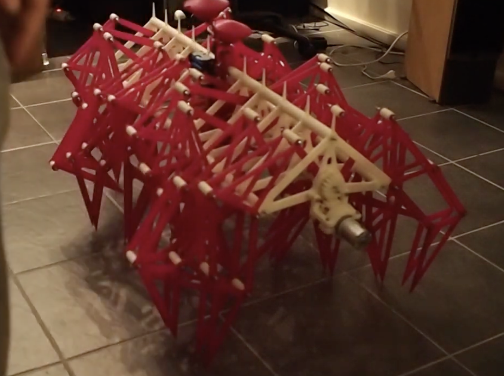
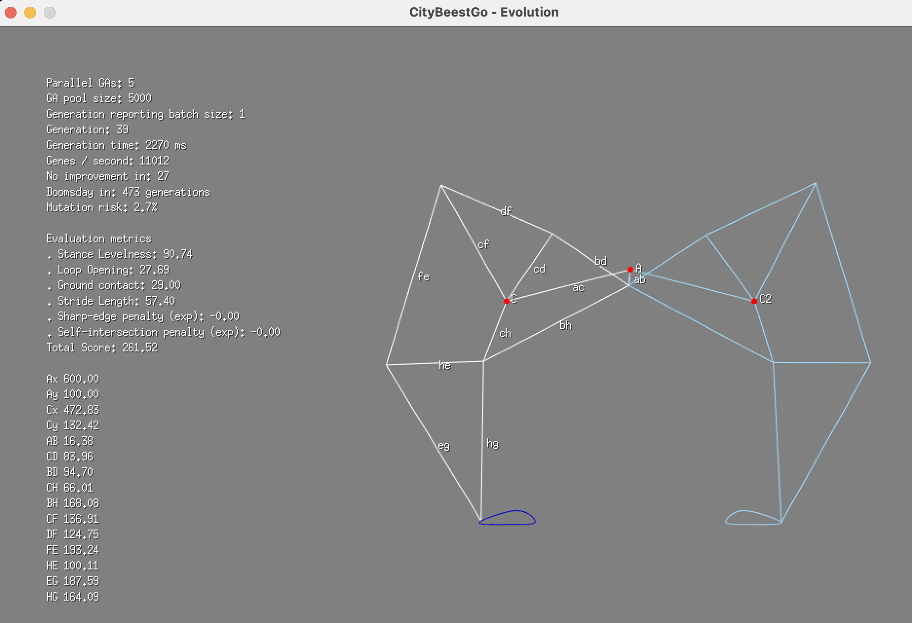
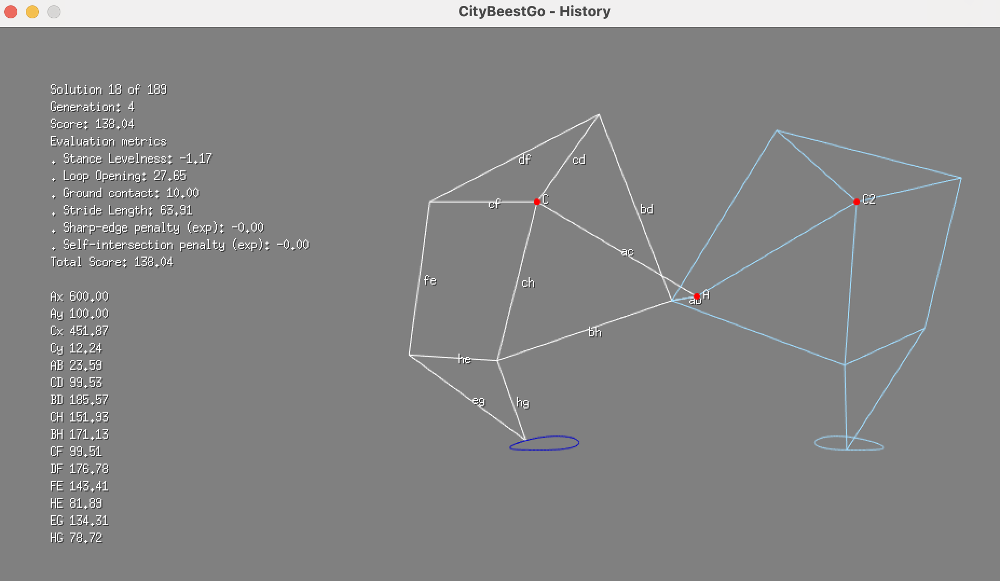

# CityBeestGo

## History 
Go/Ebiten port of the original CityBeest C++/Qt project from 2012. The program uses a genetic algorithm to evolve linkage parameters, simulate the resulting gait trajectory, and inspect/save high-scoring walkers in real time. 

The linkage is the same that is used in Theo Jansen's [Strandbeest](https://www.strandbeest.com/), but instead of using Jansen's original linkage parameters we can use this program to evolve our own.

The original C++ code was used to evolve the beest that was displayed at Trondheim Maker Faire and Rome Maker Faire in 2015. 

Click on the picture below to see the original CityBeest in action. The linkage parameters on this variant took approximately 10 days to evolve on a (at the time) high end dual Xeon machine.

[](https://www.youtube.com/watch?v=HN8uMVizr2c)


## Overview

The program uses an evolutionary strategy, where a pool of genetic algorithms initialize associated gene pools, where each "gene" represents a set of linkage parameters. These are then simulated and scored against a heuristic based objective function. The fittest individuals will survive and breed new offspring. Non-viable genes will die off.

A timer counts down to doomsday. As time goes by, the chance of mutations increases and when the timer runs out, the entire population is culled and a new one is pulled from a random pool and given a chance to compete.

Each time a new set of genes outperforms the previous best fit, the gene is saved to file. 

## A note regarding the implementation

The implementation is naive. 

There are most likely way more efficient ways to do the simulation, scoring and optimization, byt _hey_ - I was coming down with a severe case of manflu at the time and this is the best I could come up with. My fever brain could do high school math and basic geometry, not Jacobian matrices and gradients.

Running 5 GAs, each with a population size of 5000 genees on a M2 Max MacBook pro will simulate and evaluate approximately 12k genes / second.

# How to run the program 

(It might be a good idea to build it first)

You can run the evolution game with a graphical preview (definetly most fun) or "headless" if you just want to burn CPU in the background. Past winning walkers can be viewed in history mode.

## Modes

- `evolve` (default): live GA + animation.
- `headless`: GA only, saves improvements to `fittest.txt`.
- `history <file>`: load saved genes and inspect with arrow keys.

For compatibility with the C++ app behavior, you can also run:

- `citybeest headless`
- `citybeest <history-file>`
- `citybeest <window-x> <window-y>`

## Build

```bash
make all
```

## Run evolution with linkage preview

```bash
./citybeest
```



## Run evolution without gui

The preview will loop an animation of the fittest individual to date. Once the algorithm finds a better solution, the new genes will be saved to file and the preview will switch to the new one.

If evolution gets stuck on a plateau, the mutation risk increases - until doomsday, when a new population is started from a random pool.

```bash
./citybeest headless
```

## History viewer

```bash
./citybeest history
```



## Configuration

CityBeestGo reads configuration from JSON.

- Default path: `./citybeest.json`
- Optional override: `./citybeest -config <path>`
- If the config file does not exist, built-in defaults are used.
- If the config file exists but is malformed, startup fails with an error.

Example `citybeest.json`:

```json
{
  "parallel_ga_workers": 1,
  "pool_size": 5000,
  "doomsday_clock": 500,
  "best_genes_file": "fittest.txt",
  "favourite_genes_file.txt": "genes.txt",
  "generation_report_batch_size": 1
}
```

Defaults (when omitted or invalid):

- `parallel_ga_workers`: `1`
- `pool_size`: `5000`
- `doomsday_clock`: `500`
- `best_genes_file`: `"fittest.txt"`
- `favourite_genes_file.txt`: `"genes.txt"`
- `generation_report_batch_size`: `1`


## Controls

Evolution mode:

- `Enter`: Switch to arandom (but viable gene) in the preview.
- `Space`: append current gene to `genes.txt`.
- `Delete` or `Esc`: exit.

History mode:

- `Left` / `Right`: previous/next saved gene.
- `Space`: append current history gene to `selected.txt`.
- `Delete` or `Esc`: exit.

## Validation 

```bash
make install-deps   # installs revive + staticcheck
make lint           # revive ./...
make staticcheck    # staticcheck ./...
make check          # lint + staticcheck
make build          # builds ./cmd/citybeest -> ./citybeest
make all            # check + build
make clean          # removes ./citybeest
```

## License
